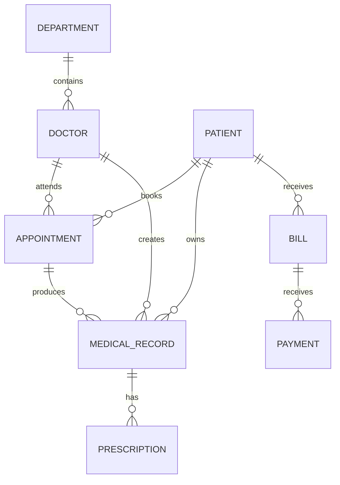

# Hospital Management System
## Complete Project Overview Report

**Report scope:** Current source tree and `pom.xml` as inspected on 2026-08-26.

**Important:** This report is an additional documentation file. No existing source, test, configuration, image, or generated file was changed.

---

## 1. Executive Summary

This project is a Java 17, Maven-based, console hospital-management application. It uses JDBC to connect to a MySQL database and provides separate command-line menus for administrators, receptionists, doctors, patients, and billing staff.

The system manages:

- Departments
- Doctors
- Patients
- Appointments
- Medical records
- Prescriptions
- Bills
- Payments

The application follows a layered structure:

```text
User
  -> Controller menus
      -> Services and LF interfaces
          -> JDBC LF implementations
              -> DBConnection
                  -> MySQL database
```

The program starts at `com.hospital.App`, which opens `MainMenu`.

---

## 2. Project Configuration

File: `pom.xml`

- Maven group ID: `com.hospital`
- Artifact ID: `hospital-management-system`
- Version: `1.0-SNAPSHOT`
- Packaging: `jar`
- Java source and target: 17
- Compiler release: 17
- MySQL Connector/J: `9.4.0`
- JUnit dependency: `3.8.1`, test scope
- Maven Compiler Plugin: `3.13.0`
- Maven Exec Plugin: `3.2.0`
- Configured main class: `com.hospital.App`

There is no web framework, REST API, ORM, GUI, Spring configuration, or visible SQL schema/setup script.

---

## 3. Complete File Inventory

### Application entry point

- `src/main/java/com/hospital/App.java`

### Controllers

- `src/main/java/com/hospital/controller/MainMenu.java`
- `src/main/java/com/hospital/controller/AdminMenu.java`
- `src/main/java/com/hospital/controller/ReceptionistMenu.java`
- `src/main/java/com/hospital/controller/DoctorMenu.java`
- `src/main/java/com/hospital/controller/PatientMenu.java`
- `src/main/java/com/hospital/controller/BillingMenu.java`
- `src/main/java/com/hospital/controller/InputHelper.java`

### LF interfaces

- `src/main/java/com/hospital/LF/PatientLF.java`
- `src/main/java/com/hospital/LF/DoctorLF.java`
- `src/main/java/com/hospital/LF/DepartmentLF.java`
- `src/main/java/com/hospital/LF/AppointmentLF.java`
- `src/main/java/com/hospital/LF/MedicalRecordLF.java`
- `src/main/java/com/hospital/LF/PrescriptionLF.java`
- `src/main/java/com/hospital/LF/BillLF.java`
- `src/main/java/com/hospital/LF/PaymentLF.java`

### LF implementations

- `src/main/java/com/hospital/impl/PatientLFImpl.java`
- `src/main/java/com/hospital/impl/DoctorLFImpl.java`
- `src/main/java/com/hospital/impl/DepartmentLFImpl.java`
- `src/main/java/com/hospital/impl/AppointmentLFImpl.java`
- `src/main/java/com/hospital/impl/MedicalRecordLFImpl.java`
- `src/main/java/com/hospital/impl/PrescriptionLFImpl.java`
- `src/main/java/com/hospital/impl/BillLFImpl.java`
- `src/main/java/com/hospital/impl/PaymentLFImpl.java`

### Model classes

- `src/main/java/com/hospital/model/Patient.java`
- `src/main/java/com/hospital/model/Doctor.java`
- `src/main/java/com/hospital/model/Department.java`
- `src/main/java/com/hospital/model/Appointment.java`
- `src/main/java/com/hospital/model/MedicalRecord.java`
- `src/main/java/com/hospital/model/Prescription.java`
- `src/main/java/com/hospital/model/Bill.java`
- `src/main/java/com/hospital/model/Payment.java`

### Services

- `src/main/java/com/hospital/service/PatientService.java`
- `src/main/java/com/hospital/service/AdminService.java`
- `src/main/java/com/hospital/service/BillingService.java`

### Utilities

- `src/main/java/com/hospital/util/DBConnection.java`
- `src/main/java/com/hospital/util/TablePrinter.java`

### Test

- `src/test/java/com/hospital/AppTest.java`

The project contains 37 application Java files and 1 test Java file.

---

## 4. Application Entry Point

### `App`

File: `src/main/java/com/hospital/App.java`

Class:

```java
public class App
```

Method:

```java
public static void main(String[] args)
```

The method calls `MainMenu.start()` and begins the application.

---

# 5. Controller Layer

The controller layer implements the console user interface. Controllers display menus, read input, construct model objects, and call services or LFs.

## 5.1 MainMenu

File: `src/main/java/com/hospital/controller/MainMenu.java`

### Field

```java
private static final Scanner scanner
```

### Method

```java
public static void start()
```

The main menu runs in a loop and provides:

| Option | Action |
|---|---|
| 1 | Open admin menu |
| 2 | Open receptionist menu |
| 3 | Open doctor menu |
| 4 | Open patient menu |
| 5 | Open billing menu |
| 0 | Exit |

The scanner is closed after the loop ends.

## 5.2 AdminMenu

File: `src/main/java/com/hospital/controller/AdminMenu.java`

### Fields

```java
private static final DepartmentLF departmentLF
private static final DoctorLF doctorLF
private static final AdminService adminService
```

Concrete objects created:

- `DepartmentLFImpl`
- `DoctorLFImpl`
- `AdminService`

### Public method

```java
public static void show(Scanner scanner)
```

Menu operations:

1. Add department
2. Update department
3. Deactivate department
4. View all departments
5. Add doctor
6. Update doctor
7. Deactivate doctor
8. View all doctors
9. View hospital records
0. Return to main menu

### Private methods

```java
private static void addDepartment(Scanner scanner)
```

Reads department name and description, creates an `ACTIVE` department with ID `0`, and inserts it.

```java
private static void updateDepartment(Scanner scanner)
```

Loads a department by ID and updates its name and description. Blank values preserve the existing values.

```java
private static void deactivateDepartment(Scanner scanner)
```

Sets a department status to `INACTIVE`.

```java
private static void addDoctor(Scanner scanner)
```

Displays departments, validates the selected department, reads doctor name, specialization, phone, and email, then inserts an `ACTIVE` doctor.

```java
private static void updateDoctor(Scanner scanner)
```

Loads a doctor by ID and allows phone and email updates. The menu does not modify name, specialization, or department.

```java
private static void deactivateDoctor(Scanner scanner)
```

Sets a doctor status to `INACTIVE`.

## 5.3 ReceptionistMenu

File: `src/main/java/com/hospital/controller/ReceptionistMenu.java`

### Fields

```java
private static final PatientLF patientLF
private static final DoctorLF doctorLF
private static final AppointmentLF appointmentLF
```

Concrete implementations:

- `PatientLFImpl`
- `DoctorLFImpl`
- `AppointmentLFImpl`

### Public method

```java
public static void show(Scanner scanner)
```

Menu operations:

1. Register patient
2. Update patient details
3. Book appointment
4. Cancel appointment
5. View today’s appointments
6. View a patient’s appointments
0. Return to main menu

### Private methods

```java
private static void registerPatient(Scanner scanner)
```

Reads name, date of birth, gender, phone, email, and address. Creates a patient with status `ACTIVE`.

```java
private static void updatePatient(Scanner scanner)
```

Loads a patient by ID and allows phone, email, and address updates. Blank input retains the existing value.

```java
private static void bookAppointment(Scanner scanner)
```

Displays patients and doctors, validates both IDs, reads date and time, creates a `SCHEDULED` appointment, and calls the appointment LF.

```java
private static void cancelAppointment(Scanner scanner)
```

Cancels an appointment by ID.

```java
private static void viewPatientAppointments(Scanner scanner)
```

Loads and displays all appointments for a patient.

## 5.4 DoctorMenu

File: `src/main/java/com/hospital/controller/DoctorMenu.java`

### Fields

```java
private static final AppointmentLF appointmentLF
private static final PatientLF patientLF
private static final MedicalRecordLF medicalRecordLF
private static final PrescriptionLF prescriptionLF
```

### Public method

```java
public static void show(Scanner scanner)
```

Menu operations:

1. View the doctor’s appointments
2. View patient details
3. Create a medical record
4. Prescribe medicine
5. View patient medical records
0. Return to main menu

### Private methods

```java
private static void viewMyAppointments(Scanner scanner)
```

Reads a doctor ID and displays that doctor’s appointments.

```java
private static void viewPatientDetails(Scanner scanner)
```

Reads a patient ID and displays the patient.

```java
private static void createMedicalRecord(Scanner scanner)
```

Finds an appointment by ID, reads diagnosis, treatment notes, and record date, creates a medical record, inserts it, and receives the generated record ID.

```java
private static void prescribeMedicine(Scanner scanner)
```

Validates a medical record, reads medicine name, dosage, and duration, and allows multiple medicines for the same record.

```java
private static void viewPatientRecords(Scanner scanner)
```

Loads and displays medical records by patient ID.

## 5.5 PatientMenu

File: `src/main/java/com/hospital/controller/PatientMenu.java`

### Field

```java
private static final PatientService patientService
```

### Public method

```java
public static void show(Scanner scanner)
```

The patient enters a patient ID. If the ID exists, the menu provides:

1. Personal details
2. Appointments
3. Medical records
4. Prescriptions
5. Full profile
0. Return to main menu

There is no password-based authentication. The patient ID is the only login value.

## 5.6 BillingMenu

File: `src/main/java/com/hospital/controller/BillingMenu.java`

### Fields

```java
private static final BillLF billLF
private static final PatientLF patientLF
private static final BillingService billingService
```

### Public method

```java
public static void show(Scanner scanner)
```

Menu operations:

1. Generate bill
2. Record payment
3. View payment history
4. View all bills
0. Return to main menu

### Private methods

```java
private static void generateBill(Scanner scanner)
```

Selects a patient, reads consultation, medicine, and other charges, reads the bill date, creates an initially `UNPAID` bill, and stores it.

```java
private static void recordPayment(Scanner scanner)
```

Loads a bill, displays it, reads amount, payment date, and payment method, then delegates to `BillingService.makePayment`.

```java
private static void viewPaymentHistory(Scanner scanner)
```

Delegates to `BillingService.viewPaymentHistory`.

## 5.7 InputHelper

File: `src/main/java/com/hospital/controller/InputHelper.java`

### Methods

```java
public static int readInt(Scanner scanner, String prompt)
```

Repeats until the user enters a valid integer.

```java
public static BigDecimal readBigDecimal(Scanner scanner, String prompt)
```

Repeats until the user enters a valid `BigDecimal`.

```java
public static String readText(Scanner scanner, String prompt)
```

Reads one line and trims surrounding whitespace.

---

# 6. Model Layer

The model classes represent hospital data. They are mutable JavaBeans with:

- Private fields
- An empty constructor
- A parameterized constructor
- Getters
- Setters
- A `toString()` override

The project does not use enums. Dates, statuses, gender, and payment methods are stored as strings.

## 6.1 Patient

File: `src/main/java/com/hospital/model/Patient.java`

### Fields

```java
private int patientId;
private String name;
private String dob;
private String gender;
private String phone;
private String email;
private String address;
private String status;
```

### Constructors

```java
public Patient()
```

```java
public Patient(
    int patientId,
    String name,
    String dob,
    String gender,
    String phone,
    String email,
    String address,
    String status
)
```

### Accessors

- `getPatientId`, `setPatientId`
- `getName`, `setName`
- `getDob`, `setDob`
- `getGender`, `setGender`
- `getPhone`, `setPhone`
- `getEmail`, `setEmail`
- `getAddress`, `setAddress`
- `getStatus`, `setStatus`

Also overrides `toString()`.

## 6.2 Department

File: `src/main/java/com/hospital/model/Department.java`

### Fields

```java
private int departmentId;
private String name;
private String description;
private String status;
```

### Constructors

- Empty constructor
- Constructor accepting all four fields

### Methods

- Getters and setters for every field
- `toString()`

## 6.3 Doctor

File: `src/main/java/com/hospital/model/Doctor.java`

### Fields

```java
private int doctorId;
private String name;
private String specialization;
private String phone;
private String email;
private Department department;
private String status;
```

A doctor belongs to a department through the `department` object.

### Constructors

- Empty constructor
- Constructor accepting all seven fields

### Methods

- Getters and setters for every field
- `toString()`

## 6.4 Appointment

File: `src/main/java/com/hospital/model/Appointment.java`

### Fields

```java
private int appointmentId;
private Patient patient;
private Doctor doctor;
private String appointmentDate;
private String appointmentTime;
private String status;
```

An appointment connects one patient and one doctor at a date and time.

### Constructors

- Empty constructor
- Constructor accepting all six fields

### Methods

- Getters and setters for every field
- `toString()`

## 6.5 MedicalRecord

File: `src/main/java/com/hospital/model/MedicalRecord.java`

### Fields

```java
private int recordId;
private Appointment appointment;
private Patient patient;
private Doctor doctor;
private String diagnosis;
private String treatmentNotes;
private String recordDate;
```

A medical record contains clinical information and references its appointment, patient, and doctor.

### Constructors

- Empty constructor
- Constructor accepting all seven fields

### Methods

- Getters and setters for every field
- `toString()`

The `toString()` output displays the appointment ID, patient name, doctor name, diagnosis, treatment notes, and record date.

## 6.6 Prescription

File: `src/main/java/com/hospital/model/Prescription.java`

### Fields

```java
private int prescriptionId;
private int recordId;
private String medicineName;
private String dosage;
private String duration;
```

A prescription belongs to a medical record using `recordId`.

### Constructors

- Empty constructor
- Constructor accepting all five fields

### Methods

- Getters and setters for every field
- `toString()`

## 6.7 Bill

File: `src/main/java/com/hospital/model/Bill.java`

### Fields

```java
private int billId;
private Patient patient;
private BigDecimal consultationCharge;
private BigDecimal medicineCharge;
private BigDecimal otherCharge;
private BigDecimal totalAmount;
private String billDate;
private String status;
```

Money is represented with `BigDecimal`.

The total is caLFulated as:

```text
consultationCharge + medicineCharge + otherCharge
```

### Constructors

- Empty constructor
- Constructor accepting all eight fields

### Methods

- Getters and setters for every field
- `toString()`

## 6.8 Payment

File: `src/main/java/com/hospital/model/Payment.java`

### Fields

```java
private int paymentId;
private int billId;
private BigDecimal amountPaid;
private String paymentDate;
private String paymentMethod;
```

A payment belongs to a bill through `billId`.

### Constructors

- Empty constructor
- Constructor accepting all five fields

### Methods

- Getters and setters for every field
- `toString()`

---

# 7. LF Interfaces

The LF layer defines persistence contracts. Each interface has one JDBC implementation in the `impl` package.

## PatientLF

File: `src/main/java/com/hospital/LF/PatientLF.java`

Implemented by `PatientLFImpl`.

```java
void addPatient(Patient patient);
void updatePatient(Patient patient);
void deactivatePatient(int patientId);
Patient getPatientById(int patientId);
List<Patient> getAllPatients();
```

## DoctorLF

File: `src/main/java/com/hospital/LF/DoctorLF.java`

Implemented by `DoctorLFImpl`.

```java
void addDoctor(Doctor doctor);
void updateDoctor(Doctor doctor);
void deactivateDoctor(int doctorId);
Doctor getDoctorById(int doctorId);
List<Doctor> getAllDoctors();
```

## DepartmentLF

File: `src/main/java/com/hospital/LF/DepartmentLF.java`

Implemented by `DepartmentLFImpl`.

```java
void addDepartment(Department department);
void updateDepartment(Department department);
void deactivateDepartment(int departmentId);
Department getDepartmentById(int departmentId);
List<Department> getAllDepartments();
```

## AppointmentLF

File: `src/main/java/com/hospital/LF/AppointmentLF.java`

Implemented by `AppointmentLFImpl`.

```java
void bookAppointment(Appointment appointment);
void cancelAppointment(int appointmentId);
boolean isDoctorAvailable(int doctorId, String date, String time);
List<Appointment> getAppointmentsByPatient(int patientId);
List<Appointment> getAppointmentsByDoctor(int doctorId);
List<Appointment> getTodaysAppointments();
List<Appointment> getAllAppointments();
```

## MedicalRecordLF

File: `src/main/java/com/hospital/LF/MedicalRecordLF.java`

Implemented by `MedicalRecordLFImpl`.

```java
void createMedicalRecord(MedicalRecord record);
MedicalRecord getRecordById(int recordId);
List<MedicalRecord> getRecordsByPatient(int patientId);
List<MedicalRecord> getRecordsByDoctor(int doctorId);
List<MedicalRecord> getAllRecords();
```

## PrescriptionLF

File: `src/main/java/com/hospital/LF/PrescriptionLF.java`

Implemented by `PrescriptionLFImpl`.

```java
void addPrescription(Prescription prescription);
List<Prescription> getPrescriptionsByRecord(int recordId);
```

## BillLF

File: `src/main/java/com/hospital/LF/BillLF.java`

Implemented by `BillLFImpl`.

```java
void generateBill(Bill bill);
void updateBillStatus(int billId, String status);
Bill getBillById(int billId);
List<Bill> getBillsByPatient(int patientId);
List<Bill> getAllBills();
```

## PaymentLF

File: `src/main/java/com/hospital/LF/PaymentLF.java`

Implemented by `PaymentLFImpl`.

```java
void recordPayment(Payment payment);
List<Payment> getPaymentsByBill(int billId);
List<Payment> getAllPayments();
```

There is no LF inheritance hierarchy beyond each implementation implementing its matching interface.

---

# 8. LF Implementation Layer

All LF implementation classes use JDBC, `DBConnection`, `PreparedStatement`, `ResultSet`, and try-with-resources. SQL exceptions are printed to the console. Retrieval operations generally return `null` for a missing single object or an empty list for no collection results.

## 8.1 DepartmentLFImpl

File: `src/main/java/com/hospital/impl/DepartmentLFImpl.java`

Implements `DepartmentLF`.

### Database table

```text
department
```

### Columns used

```text
department_id
name
description
status
```

### Methods

- `addDepartment`: inserts a department
- `updateDepartment`: updates name, description, and status by ID
- `deactivateDepartment`: changes status to `INACTIVE`
- `getDepartmentById`: selects one department
- `getAllDepartments`: selects all departments

## 8.2 PatientLFImpl

File: `src/main/java/com/hospital/impl/PatientLFImpl.java`

Implements `PatientLF`.

### Database table

```text
patient
```

### Columns used

```text
patient_id
name
dob
gender
phone
email
address
status
```

### Methods

- `addPatient`: inserts all patient details
- `updatePatient`: updates all patient fields by ID
- `deactivatePatient`: changes status to `INACTIVE`
- `getPatientById`: selects one patient
- `getAllPatients`: selects all patients

## 8.3 DoctorLFImpl

File: `src/main/java/com/hospital/impl/DoctorLFImpl.java`

Implements `DoctorLF`.

### Database tables

```text
doctor
department
```

### Methods

- `addDoctor`: inserts doctor data and department ID
- `updateDoctor`: updates doctor information and department ID
- `deactivateDoctor`: changes doctor status to `INACTIVE`
- `getDoctorById`: loads doctor and joined department
- `getAllDoctors`: loads all doctors and joined departments

A null department causes `IllegalArgumentException` during add/update.

The doctor retrieval SQL uses an inner `JOIN`, so a doctor must have a matching department row to be returned.

## 8.4 AppointmentLFImpl

File: `src/main/java/com/hospital/impl/AppointmentLFImpl.java`

Implements `AppointmentLF`.

### Constant field

```java
private static final String BASE_SELECT
```

The base query joins:

```text
appointment
patient
doctor
department
```

### Private method

```java
private Appointment mapRow(ResultSet rs)
```

Maps one database row into:

```text
Appointment
├── Patient
└── Doctor
    └── Department
```

### Methods

- `bookAppointment`: checks availability, then inserts an appointment with `SCHEDULED` status
- `cancelAppointment`: sets status to `CANCELLED`
- `isDoctorAvailable`: counts matching `SCHEDULED` appointments for doctor/date/time
- `getAppointmentsByPatient`: retrieves patient appointments ordered by date and time
- `getAppointmentsByDoctor`: retrieves doctor appointments ordered by date and time
- `getTodaysAppointments`: uses MySQL `CURDATE()` and orders by time
- `getAllAppointments`: retrieves all appointments ordered by date and time

Cancelled appointments do not block a doctor’s time slot because availability only checks `SCHEDULED` rows.

## 8.5 MedicalRecordLFImpl

File: `src/main/java/com/hospital/impl/MedicalRecordLFImpl.java`

Implements `MedicalRecordLF`.

### Constant field

```java
private static final String BASE_SELECT
```

The base query joins:

```text
medical_record
appointment
patient
doctor
department
```

### Private method

```java
private MedicalRecord mapRow(ResultSet rs)
```

Builds a complete object graph:

```text
MedicalRecord
├── Appointment
│   ├── Patient
│   └── Doctor
│       └── Department
├── Patient
└── Doctor
    └── Department
```

### Methods

- `createMedicalRecord`: inserts record data and writes the generated ID back to the model
- `getRecordById`: retrieves one record
- `getRecordsByPatient`: retrieves records by patient, newest record date first
- `getRecordsByDoctor`: retrieves records by doctor, newest record date first
- `getAllRecords`: retrieves all records, newest record date first

## 8.6 PrescriptionLFImpl

File: `src/main/java/com/hospital/impl/PrescriptionLFImpl.java`

Implements `PrescriptionLF`.

### Database table

```text
prescription
```

### Columns used

```text
prescription_id
record_id
medicine_name
dosage
duration
```

### Methods

- `addPrescription`: inserts a prescription
- `getPrescriptionsByRecord`: retrieves prescriptions for a medical record

## 8.7 BillLFImpl

File: `src/main/java/com/hospital/impl/BillLFImpl.java`

Implements `BillLF`.

### Constant field

```java
private static final String BASE_SELECT
```

The base query joins `bill` and `patient`.

### Private method

```java
private Bill mapRow(ResultSet rs)
```

Creates a `Patient` and uses it to create a `Bill`.

### Methods

- `generateBill`: caLFulates the total and inserts the bill
- `updateBillStatus`: updates a bill status by ID
- `getBillById`: retrieves one bill
- `getBillsByPatient`: retrieves patient bills newest first
- `getAllBills`: retrieves all bills newest first

### Total caLFulation

```text
Total = consultation charge + medicine charge + other charge
```

The inserted bill status is always `UNPAID`, and the generated bill ID is written back to the model.

## 8.8 PaymentLFImpl

File: `src/main/java/com/hospital/impl/PaymentLFImpl.java`

Implements `PaymentLF`.

### Database table

```text
payment
```

### Methods

- `recordPayment`: inserts a payment and writes the generated ID back to the model
- `getPaymentsByBill`: retrieves payments for one bill ordered by payment date
- `getAllPayments`: retrieves all payments newest first

---

# 9. Service Layer

## 9.1 PatientService

File: `src/main/java/com/hospital/service/PatientService.java`

### Fields

```java
private final PatientLF patientLF
private final AppointmentLF appointmentLF
private final MedicalRecordLF medicalRecordLF
private final PrescriptionLF prescriptionLF
```

### Methods

```java
public Patient viewPersonalDetails(int patientId)
```

Returns a patient by ID.

```java
public List<Appointment> viewAppointments(int patientId)
```

Returns all appointments for the patient.

```java
public List<MedicalRecord> viewMedicalRecords(int patientId)
```

Returns all medical records for the patient.

```java
public List<Prescription> viewPrescriptions(int patientId)
```

Loads all patient medical records, retrieves prescriptions for each record, and combines them into one list.

```java
public void viewFullProfile(int patientId)
```

Displays personal details, appointments, medical records, and prescriptions in one operation.

## 9.2 AdminService

File: `src/main/java/com/hospital/service/AdminService.java`

### Fields

```java
private final DoctorLF doctorLF
private final PatientLF patientLF
private final DepartmentLF departmentLF
```

### Method

```java
public void viewHospitalRecords()
```

Displays all departments, doctors, and patients.

It does not display appointments, medical records, prescriptions, bills, or payments.

## 9.3 BillingService

File: `src/main/java/com/hospital/service/BillingService.java`

### Fields

```java
private final BillLF billLF
private final PaymentLF paymentLF
```

### Methods

```java
public void makePayment(Payment payment)
```

Processing sequence:

1. Load the bill
2. Stop when the bill does not exist
3. Stop when the bill is already `PAID`
4. Insert the payment
5. Sum every payment for that bill
6. Compare total paid with the bill total
7. Update the bill status

Status rules:

```text
total paid >= bill total -> PAID
total paid > 0           -> PARTIAL
total paid == 0          -> UNPAID
```

```java
public BigDecimal getTotalPaid(int billId)
```

Loads every payment for a bill and sums `amountPaid`.

```java
public void viewPaymentHistory(int billId)
```

Displays the bill, all payments, total paid, and remaining balance.

Remaining balance is caLFulated as:

```text
bill total - total paid
```

---

# 10. Utility Layer

## 10.1 DBConnection

File: `src/main/java/com/hospital/util/DBConnection.java`

### Fields

```java
private static final String URL
private static final String USERNAME
private static final String PASSWORD
```

The connection points to a local MySQL database:

```text
Host: localhost
Port: 3306
Database: hospital
User: hospital_user
```

A database password is stored directly in the source file.

### Method

```java
public static Connection getConnection() throws SQLException
```

Uses `DriverManager.getConnection` to open a new JDBC connection.

## 10.2 TablePrinter

File: `src/main/java/com/hospital/util/TablePrinter.java`

The class converts model objects into formatted console tables.

### Appointment methods

```java
public static void printAppointments(List<Appointment> appointments)
public static void printAppointment(Appointment appointment)
```

### Patient methods

```java
public static void printPatients(List<Patient> patients)
public static void printPatient(Patient patient)
```

### Doctor methods

```java
public static void printDoctors(List<Doctor> doctors)
public static void printDoctor(Doctor doctor)
```

### Department methods

```java
public static void printDepartments(List<Department> departments)
public static void printDepartment(Department department)
```

### Medical record methods

```java
public static void printMedicalRecords(List<MedicalRecord> records)
public static void printMedicalRecord(MedicalRecord record)
```

### Prescription methods

```java
public static void printPrescriptions(List<Prescription> prescriptions)
public static void printPrescription(Prescription prescription)
```

### Bill methods

```java
public static void printBills(List<Bill> bills)
public static void printBill(Bill bill)
```

### Payment methods

```java
public static void printPayments(List<Payment> payments)
public static void printPayment(Payment payment)
```

### Private method

```java
private static void printTable(String[] headers, String[][] data)
```

This method caLFulates column widths, prints separator lines, prints headers, prints rows, and substitutes empty strings for null values.

Single-object print methods delegate to their list equivalent using a one-element list.

---

# 11. Database Tables Inferred From SQL

The source code directly references these MySQL tables:

| Table | Main columns referenced | Related model |
|---|---|---|
| `department` | `department_id`, `name`, `description`, `status` | `Department` |
| `doctor` | `doctor_id`, `name`, `specialization`, `phone`, `email`, `department_id`, `status` | `Doctor` |
| `patient` | `patient_id`, `name`, `dob`, `gender`, `phone`, `email`, `address`, `status` | `Patient` |
| `appointment` | `appointment_id`, `patient_id`, `doctor_id`, `appointment_date`, `appointment_time`, `status` | `Appointment` |
| `medical_record` | `record_id`, `appointment_id`, `patient_id`, `doctor_id`, `diagnosis`, `treatment_notes`, `record_date` | `MedicalRecord` |
| `prescription` | `prescription_id`, `record_id`, `medicine_name`, `dosage`, `duration` | `Prescription` |
| `bill` | `bill_id`, `patient_id`, `consultation_charge`, `medicine_charge`, `other_charge`, `total_amount`, `bill_date`, `status` | `Bill` |
| `payment` | `payment_id`, `bill_id`, `amount_paid`, `payment_date`, `payment_method` | `Payment` |

The source assumes foreign-key relationships between these tables, but the database schema itself is not included in the project files.

---

# 12. Domain Relationships



Object relationships:

```text
Department
  -> Doctor.department

Appointment
  -> Appointment.patient
  -> Appointment.doctor
      -> Doctor.department

MedicalRecord
  -> MedicalRecord.appointment
  -> MedicalRecord.patient
  -> MedicalRecord.doctor

Prescription
  -> Prescription.recordId

Bill
  -> Bill.patient

Payment
  -> Payment.billId
```

---

# 13. Complete User Workflows

## 13.1 Registering a patient

```text
MainMenu
  -> ReceptionistMenu
      -> Register Patient
          -> PatientLFImpl.addPatient
              -> INSERT INTO patient
```

The new patient receives `ACTIVE` status.

## 13.2 Creating a department

```text
MainMenu
  -> AdminMenu
      -> Add Department
          -> DepartmentLFImpl.addDepartment
              -> INSERT INTO department
```

## 13.3 Creating a doctor

```text
MainMenu
  -> AdminMenu
      -> Add Doctor
          -> Select department
          -> DoctorLFImpl.addDoctor
              -> INSERT INTO doctor
```

A doctor must have a department object.

## 13.4 Booking an appointment

```text
ReceptionistMenu
  -> Select patient
  -> Select doctor
  -> Enter appointment date and time
  -> AppointmentLFImpl.isDoctorAvailable
  -> AppointmentLFImpl.bookAppointment
      -> INSERT INTO appointment
```

The appointment is stored as `SCHEDULED` if the doctor has no scheduled appointment at that date and time.

## 13.5 Cancelling an appointment

```text
ReceptionistMenu
  -> Enter appointment ID
  -> AppointmentLFImpl.cancelAppointment
      -> UPDATE appointment SET status = 'CANCELLED'
```

## 13.6 Creating a medical record

```text
DoctorMenu
  -> Enter appointment ID
  -> Find appointment
  -> Enter diagnosis and treatment notes
  -> MedicalRecordLFImpl.createMedicalRecord
      -> INSERT INTO medical_record
```

The patient and doctor are taken from the selected appointment.

## 13.7 Adding prescriptions

```text
DoctorMenu
  -> Enter medical record ID
  -> Enter medicine name, dosage, and duration
  -> PrescriptionLFImpl.addPrescription
      -> INSERT INTO prescription
```

The doctor may add multiple medicines for one medical record.

## 13.8 Generating a bill

```text
BillingMenu
  -> Select patient
  -> Enter consultation charge
  -> Enter medicine charge
  -> Enter other charge
  -> Enter bill date
  -> BillLFImpl.generateBill
      -> CaLFulate total
      -> INSERT INTO bill
```

New bills are stored as `UNPAID`.

## 13.9 Recording a payment

```text
BillingMenu
  -> Select bill
  -> Enter amount, date, and method
  -> BillingService.makePayment
      -> PaymentLFImpl.recordPayment
      -> Sum all payments
      -> Determine status
      -> BillLFImpl.updateBillStatus
```

Possible resulting statuses are `UNPAID`, `PARTIAL`, and `PAID`.

## 13.10 Viewing a patient profile

```text
PatientMenu
  -> Enter patient ID
  -> PatientService.viewFullProfile
      -> Personal details
      -> Appointments
      -> Medical records
      -> Prescriptions
```

---

# 14. Status Values

The source uses string literals rather than enums or constants.

## Patient, doctor, and department

```text
ACTIVE
INACTIVE
```

## Appointment

```text
SCHEDULED
CANCELLED
```

## Bill

```text
UNPAID
PARTIAL
PAID
```

## Payment methods requested by the menu

```text
CASH
CARD
UPI
```

The input is not programmatically restricted to those payment method values.

---

# 15. Validation and Error Handling

Implemented validation and checks:

- Integer input retry loop
- Decimal input retry loop
- Patient existence checks
- Doctor existence checks
- Department existence checks
- Medical record existence checks
- Bill existence checks
- Doctor availability check
- Null department rejection for doctors
- Empty-list messages in table output
- Null-safe table output for most model fields

Not implemented in the current source:

- Date format validation
- Time format validation
- Email validation
- Phone validation
- Required-field validation
- Positive monetary-value validation
- Payment-overpayment prevention
- Authentication passwords
- User accounts or role credentials
- Authorization enforcement
- Database transactions
- Connection pooling
- Centralized status constants or enums
- Logging framework
- Database schema/setup script

Database exceptions are generally printed with `printStackTrace()` rather than converted into application-level error objects.

---

# 16. Testing

File: `src/test/java/com/hospital/AppTest.java`

The test uses JUnit 3 style and extends `TestCase`.

### Constructor

```java
public AppTest(String testName)
```

### Test suite method

```java
public static Test suite()
```

Returns a `TestSuite` containing `AppTest.class`.

### Test method

```java
public void testApp()
```

Only checks:

```java
assertTrue(true);
```

The test does not exercise the database, menus, services, models, LF implementations, billing rules, appointment rules, or input handling.

The current Maven test result is:

```text
Tests run: 1
Failures: 0
Errors: 0
Skipped: 0
```

---

# 17. Architectural Summary

The project is a small layered console application.

## Presentation/controller layer

The role menus manage user interaction:

- `MainMenu`
- `AdminMenu`
- `ReceptionistMenu`
- `DoctorMenu`
- `PatientMenu`
- `BillingMenu`
- `InputHelper`

## Business/service layer

Services coordinate related operations:

- `PatientService` combines patient, appointment, medical-record, and prescription access.
- `AdminService` combines department, doctor, and patient retrieval.
- `BillingService` combines bills and payments and applies payment-status rules.

## Data-access layer

LF interfaces define persistence operations, while `impl` classes execute JDBC SQL:

```text
PatientLF       -> PatientLFImpl
DoctorLF        -> DoctorLFImpl
DepartmentLF    -> DepartmentLFImpl
AppointmentLF   -> AppointmentLFImpl
MedicalRecordLF -> MedicalRecordLFImpl
PrescriptionLF  -> PrescriptionLFImpl
BillLF          -> BillLFImpl
PaymentLF       -> PaymentLFImpl
```

## Domain/model layer

The model objects represent the hospital concepts and their relationships:

```text
Department -> Doctor
Patient + Doctor -> Appointment
Appointment + Patient + Doctor -> MedicalRecord
MedicalRecord -> Prescription
Patient -> Bill -> Payment
```

## Persistence layer

`DBConnection` opens MySQL connections, and each LF implementation runs SQL against the hospital database.

---

# 18. Final Concept

This system models a hospital’s basic operational cycle:

1. An administrator creates departments and doctors.
2. A receptionist registers patients.
3. The receptionist books appointments between patients and doctors.
4. Doctors inspect appointments and patient information.
5. Doctors create medical records containing diagnoses and treatment notes.
6. Doctors attach one or more prescriptions to medical records.
7. Billing staff generate bills for patients.
8. Billing staff record one or more payments against bills.
9. The system recaLFulates payment totals and changes bill status.
10. Patients can view their personal details, appointments, medical records, prescriptions, and complete profile.

The implementation is a direct JDBC console application with simple layered organization and database-backed CRUD operations. It provides the core hospital workflow but does not currently include secure authentication, advanced validation, transactional workflows, or comprehensive automated tests.
